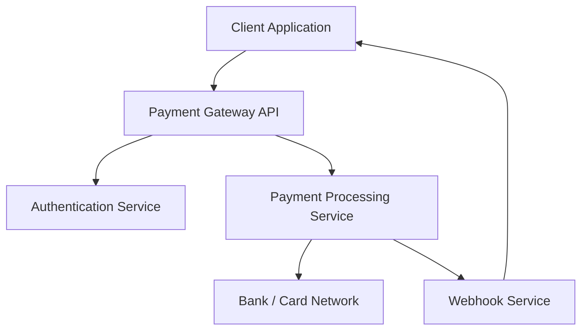

# Payment Gateway Documentation

## Overview

The Payment Gateway System enables businesses to securely process online payments through a unified set of REST APIs. The platform supports payment creation, transaction tracking, refunds, and real-time payment notifications through webhooks.

The system is designed to simplify payment integration for web and mobile applications while ensuring secure communication, reliable transaction processing, and seamless payment status updates. It supports multiple payment methods, including credit cards, debit cards, UPI, net banking, and digital wallets.

The Payment Gateway APIs follow REST principles and exchange data in JSON format. Authentication is performed using API keys, and all requests must be made over HTTPS to ensure secure data transmission. The platform also provides standardized error responses to help developers quickly identify and resolve integration issues.

## Features

- Secure payment processing through REST APIs
- Support for credit cards, debit cards, UPI, net banking, and digital wallets
- Real-time payment status tracking
- Full and partial refund management
- Webhook notifications for payment events
- API key-based authentication and authorization
- Transaction history and audit tracking
- Standardized error handling and response codes
- Multi-currency payment support
- Sandbox environment for testing integrations
- Payment cancellation and reversal support

## Tech Stack

- REST APIs
- JSON
- HTTPS
- Webhooks
- API Keys
- OAuth 2.0
- Payment Processing Services
- SSL/TLS Encryption
- Cloud Infrastructure
- Relational Databases

## Prerequisites

Before using the Payment Gateway APIs, ensure you have:

- An active merchant account
- A valid API key
- HTTPS-enabled application
- Internet connectivity
- Access to the Payment Gateway Dashboard
- A supported programming language or framework for integration
- Access to sandbox credentials for testing
- Basic understanding of HTTP status codes

## Assumptions

This documentation assumes that:

- The reader has a basic understanding of REST APIs
- The reader has access to a merchant account
- The reader possesses valid API credentials
- The integration is performed over a secure HTTPS connection.
- The reader is familiar with JSON request and response formats.
- The reader has basic knowledge of payment processing concepts.
- The reader has access to the required development and testing environments.


## Installation

1. Create a merchant account.
2. Generate API credentials from the Payment Gateway Dashboard.
3. Configure the API key in your application.
4. Set up a secure HTTPS endpoint.
5. Install the required dependencies for your application.
6. Configure webhook endpoints to receive payment notifications.
7. Verify connectivity using the health check API.
8. Perform a test transaction using sandbox credentials.

## Authentication

All API requests require a valid API key in the request header.

### Authentication Method

The Payment Gateway uses API key-based authentication to authorize requests.

### Header Format

Authorization: Bearer <API_KEY>

### Security Best Practices

- Store API keys securely.
- Never expose API keys in client-side code.
- Rotate API keys periodically.
- Use HTTPS for all API requests.
- Revoke compromised API keys immediately.

### Authentication Errors

| Status Code | Description |
|:-----------:|:-----------:|
| 401 | Invalid API key |
| 403 | Access denied |
| 429 | Rate limit exceeded |

## Supported Payment Methods

The Payment Gateway supports multiple payment methods to provide flexibility for businesses and customers.

- Credit Cards
- Debit Cards
- UPI
- Net Banking
- Digital Wallets
- EMI Payments
- International Cards

### Payment Method Availability

The availability of payment methods may vary based on merchant configuration, customer location, and regulatory requirements.

### Supported Currencies

- USD
- EUR
- GBP
- INR
- AUD
- CAD

## Payment Flow

The following workflow describes the payment lifecycle from payment initiation to transaction completion.

1. Customer initiates a payment through the application.
2. The application sends a payment request to the Payment Gateway API.
3. The Payment Gateway validates the request and processes the transaction.
4. The customer completes the payment using the selected payment method.
5. The Payment Gateway communicates with the payment processor and financial institution.
6. The transaction status is returned to the application.
7. A webhook notification is sent to the configured endpoint.
8. The application updates the payment status and displays the result to the customer.

### Payment Statuses

- Pending
- Processing
- Success
- Failed
- Cancelled
- Refunded

### Webhook Events

The Payment Gateway sends webhook notifications for important payment events.

- payment.created
- payment.processing
- payment.success
- payment.failed
- payment.cancelled
- payment.refunded

## Architecture

The Payment Gateway System follows a service-oriented architecture designed to provide secure, scalable, and reliable payment processing.

### Components

- Client Application
- Payment Gateway API
- Authentication Service
- Payment Processing Service
- Webhook Service
- Database
- Payment Processor
- Bank / Card Network

### Architecture Diagram



### Architecture Benefits

- Scalable transaction processing
- Secure communication using HTTPS
- Real-time payment notifications
- Centralized authentication and authorization
- Reliable transaction tracking

## Security Considerations

Security is a critical aspect of payment processing. The Payment Gateway implements multiple security controls to protect sensitive payment data and ensure secure communication between systems.

### Security Measures

- All API requests are transmitted over HTTPS.
- Sensitive payment data is encrypted during transmission.
- API key-based authentication is used to authorize requests.
- Access controls are enforced through authentication and authorization mechanisms.
- Audit logs are maintained for transaction tracking and compliance purposes.
- Webhook requests can be verified using signature validation.
- Rate limiting is implemented to prevent abuse and unauthorized access.
- Payment card information is never stored in plain text.
- Failed authentication attempts are monitored and logged.
- Security controls are reviewed and updated periodically.

### Best Practices

- Store API keys securely and never expose them in client-side code.
- Rotate API credentials periodically.
- Use strong access controls for merchant accounts.
- Monitor transaction logs for suspicious activity.
- Immediately revoke compromised API credentials.

## Error Handling

The API returns standard HTTP status codes to indicate the success or failure of a request.

| Status Code | Description |
|:-----------:|:-----------:|
| 200 | Request successful |
| 201 | Resource created successfully |
| 400 | Invalid request |
| 401 | Unauthorized |
| 403 | Forbidden |
| 404 | Resource not found |
| 409 | Resource conflict |
| 422 | Validation error |
| 429 | Too many requests |
| 500 | Internal server error |
| 503 | Service unavailable |

### Error Response Format

```json
{
  "errorCode": "INVALID_REQUEST",
  "message": "The request payload is invalid."
}
```
### Common Error Scenarios

- Missing required request parameters
- Invalid API credentials
- Insufficient permissions
- Unsupported payment method
- Invalid transaction identifier
- Rate limit exceeded
- Duplicate payment request
- Temporary service outage
  
## FAQ

### How do I obtain an API key?

Create a merchant account and generate an API key from the Payment Gateway Dashboard.

### Can I process refunds?

Yes. The Payment Gateway API supports full and partial refunds.

### How will I receive payment updates?

Payment updates are delivered through webhook notifications.

### Which payment methods are supported?

The gateway supports credit cards, debit cards, UPI, net banking, digital wallets, and EMI payments.

### Is HTTPS required?

Yes. All API requests must be transmitted over HTTPS to ensure secure communication.

### Can I test integrations before going live?

Yes. The Payment Gateway provides a sandbox environment for testing and validation.

### What should I do if a payment fails?

Review the API response, verify the request parameters, and refer to the Error Handling section for troubleshooting guidance.

## Glossary

- API Key – Credential used to authenticate API requests.
- Authentication – Process of verifying the identity of a user or application.
- Authorization – Process of granting access to resources after authentication.
- Webhook – Automated HTTP callback triggered by an event.
- Merchant – Business or organization using the Payment Gateway.
- Customer – End user making a payment transaction.
- Transaction – A payment-related operation processed by the system.
- Refund – Reversal of a completed payment transaction.
- Payment Processor – Service responsible for processing payment transactions.
- Sandbox – Testing environment used for development and integration.
- HTTPS – Secure protocol used for transmitting data over the internet.
- JSON – Lightweight data-interchange format used by the APIs.
