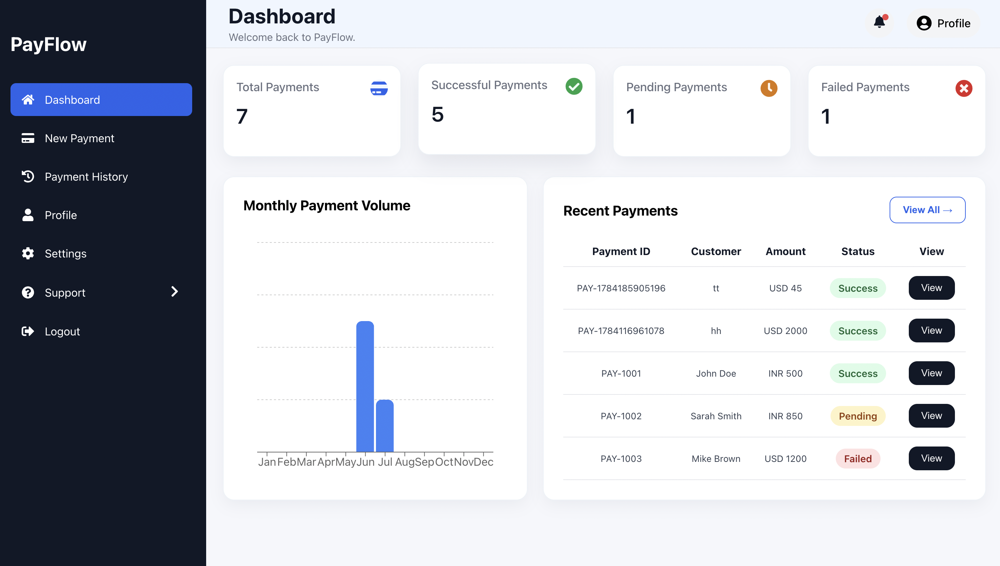

# PayFlow

PayFlow is a React-based payment gateway management application that simulates the complete payment lifecycle. It enables users to create and manage payments, monitor transactions, manage account information, and submit support requests through a clean and responsive interface.



## Table of Contents
- [Overview](#overview)
- [Version Information](#version-information)
- [Features](#features)
- [Technology Stack](#technology-stack)
- [Project Structure](#project-structure)
- [Prerequisites](#prerequisites)
- [Installation](#installation)
- [Usage](#usage)
- [Documentation](#documentation)
- [Known Limitations](#known-limitations)
- [Future Enhancements](#future-enhancements)
- [License](#license)

## Version Information

| Property | Value |
|----------|-------|
| Version | 1.0.0 |
| Release Date | July 2026 |
| Status | Stable |
| License | Educational & Portfolio Project |

# Overview

PayFlow demonstrates the core functionality of a payment gateway management system. The application includes user authentication, payment creation, transaction tracking, payment analytics, profile management, password management, and customer support.

The project uses React, Context API, and a service layer backed by localStorage to simulate backend operations, making it suitable for learning, technical documentation, and portfolio demonstrations.

# Features

## Authentication
- User Login
- User Registration
- Protected Routes

## Dashboard
- Payment Statistics
- Monthly Payment Chart
- Recent Payments
- Notifications

## Payment Management
- Create New Payment
- Payment History
- Payment Details
- Search Payments
- Filter by Status
- Export Payments to CSV
- Pagination

## User Management
- Profile Management
- Change Password

## Customer Support
- Contact Support
- Support Ticket Tracking
- View Ticket Details
- Frequently Asked Questions (FAQ)

## Additional Features
- Responsive Design
- Toast Notifications

# Technology Stack

- React
- JavaScript (ES6+)
- Context API
- React Router
- CSS3
- Recharts
- React Toastify
- localStorage

# Project Structure

```text
src/
├── components/            # Reusable UI components
├── context/               # React Context providers
├── layouts/               # Application layouts
├── pages/
│   ├── Authentication/
│   │   ├── Login/
│   │   └── Signup/
│   ├── Dashboard/
│   ├── NewPayment/
│   ├── PaymentHistory/
│   ├── PaymentSuccess/
│   ├── Profile/
│   ├── Settings/
│   ├── ContactSupport/
│   ├── SupportTickets/
│   └── FAQ/
├── services/              # Business logic and localStorage operations
├── styles/                # Global styles
├── App.js
└── index.js
```

## Prerequisites

Before running the application, ensure the following software is installed on your system:

- Node.js (v18 or later recommended)
- npm (included with Node.js)
- A modern web browser (Google Chrome, Microsoft Edge, or Mozilla Firefox)

# Installation

Clone the repository.

```bash
git clone https://github.com/ship123456/payment-gateway
```

Navigate to the project directory.

```bash
cd payment-gateway
```

Install the required dependencies.

```bash
npm install
```

Start the development server.

```bash
npm start
```

The application will be available at:

```text
http://localhost:3000
```

# Usage

1. Sign in using an existing account or create a new account.
2. View payment statistics on the Dashboard.
3. Create a new payment transaction.
4. View, search, filter, and export payment history.
5. Manage your profile information.
6. Change your account password.
7. Submit support tickets and monitor their status.
8. Browse frequently asked questions from the FAQ page.

# Documentation

The project includes the following documentation:

- User Guide
- API Documentation
- Technical Overview
- Troubleshooting Guide

# Known Limitations

- Uses localStorage instead of a backend database.
- Authentication is simulated.
- No real payment gateway integration.
- Data is stored locally and is not synchronized across devices.

# Future Enhancements

- Backend API integration
- JWT-based authentication
- Database integration
- Real payment gateway integration
- Email verification
- Password recovery via email
- Role-based access control
- Real-time payment updates
- Transaction analytics and reporting

# License

This project was created for educational and portfolio purposes.
