# PayFlow User Guide

This guide explains how to use the PayFlow application. It covers user authentication, payment management, profile management, customer support, and frequently asked questions.

---

# Table of Contents

- [Login](#login)
- [Sign Up](#sign-up)
- [Dashboard](#dashboard)
- [Notifications](#notifications)
- [Create a New Payment](#create-a-new-payment)
- [Payment Success](#payment-success)
- [Payment History](#payment-history)
- [Payment Details](#payment-details)
- [Profile](#profile)
- [Change Password](#change-password)
- [Contact Support](#contact-support)
- [Support Tickets](#support-tickets)
- [Support Ticket Details](#support-ticket-details)
- [Frequently Asked Questions](#frequently-asked-questions)

# Login

## Purpose

The Login page allows registered users to securely access the PayFlow application.

## Fields

| Field | Description | required
|--------|-------------| -------- |
| Email | Registered email address | yes |
| Password | Account password |  yes |

## Buttons

| Button | Description |
|----------|-------------|
| Login | Authenticates the user and opens the Dashboard. |
| Sign Up | Opens the registration page for new users. |

## Steps

1. Enter your registered email address.
2. Enter your password.
3. Click **Login**.

## Result

If the credentials are valid, the Dashboard page is displayed.

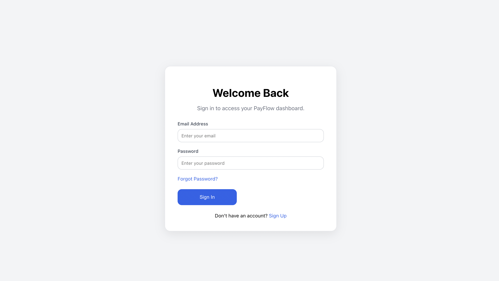

# Sign Up

## Purpose

The Sign Up page allows new users to create an account.

## Fields

| Field | Description | Required 
|--------|-------------| -------- |
| Full Name | User's name | yes    |
| Email | Email address | yes    |
| Password | Account password | yes    |
| Confirm Password | Account password | yes   |

## Buttons

| Button | Description |
|----------|-------------|
| Create Account | Creates a new account. |
| Back to Login | Returns to the Login page. |

## Steps

1. Enter all required information.
2. Click **Create Account**.
3. Return to Login.
4. Sign in using the newly created account.

## Result

A new account is created successfully.

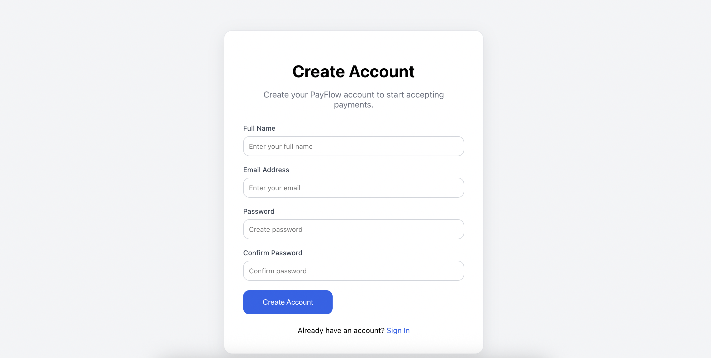

# Dashboard

## Purpose

The Dashboard provides an overview of payment activity.

## Available Information

- Total Payments
- Successful Payments
- Pending Payments
- Failed Payments
- Monthly Payment Chart
- Recent Payments
- Notifications

## Actions

- View recent payment details.
- Navigate to Payment History.
- Access other application modules.

## Result

Users can monitor payment activity from a single location.

# Notifications

## Purpose

The notification panel displays recent payment and application updates.

## Steps

1. Click the notification bell.
2. Review the available notifications.
3. Close the notification panel.

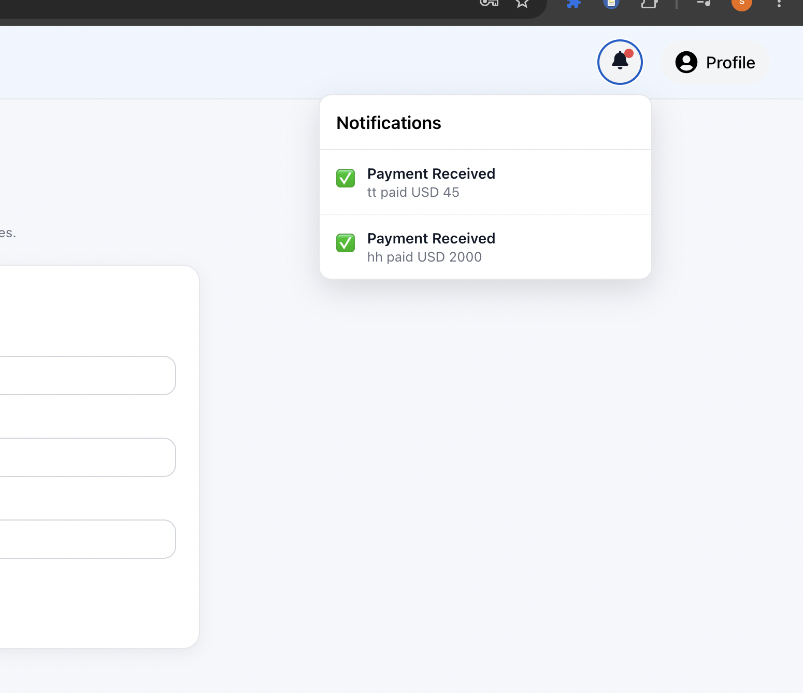

# Create a New Payment

## Purpose

Allows users to create a payment transaction.

## Fields

Document every field available in your form here.

Example:

| Field | Description | required
|--------|-------------|------|
| Customer Name | Name of the customer | yes|
| Payment Id | payment Id of the transaction |yes|
| Customer Email | Email address |yes|
| Phone Number | Customer phone number |yes|
| Amount | Payment amount |yes|
| Currency | Payment currency |yes|
| Payment Method | Selected payment method |yes|
| Description | Payment description |no|

## Buttons

| Button | Description |
|----------|-------------|
| Create Payment | Creates a new payment. |
| Cancel | Returns to Dashboard. |

## Steps

1. Complete all required fields.
2. Verify the Payment Summary.
3. Click **Create Payment**.

## Validation

Describe every validation implemented.

## Result

The payment is created and the application redirects to the Payment Success page.

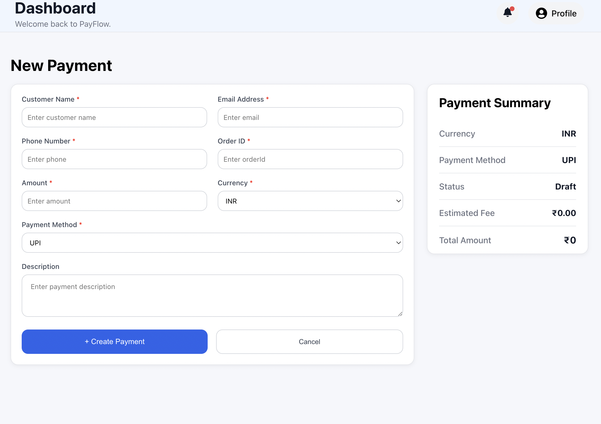

# Payment Success

## Purpose

Confirms successful payment creation.

## Information Displayed

- Payment ID
- Customer
- Amount
- Currency
- Status
- Date

## Buttons

- Create New Transaction
- View Payments

## Result

Users can immediately create another payment or review payment history.

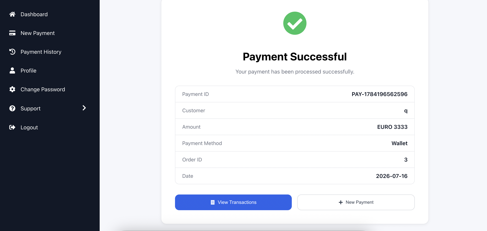

# Payment History

## Purpose

Displays all created payments.

## Features

- Search
- Status Filter
- Export CSV
- Pagination
- Payment Details

## Table Columns

- Payment ID
- Customer
- Amount
- Currency
- Status
- Date
- Actions

## Result

Users can efficiently manage and review payment records.

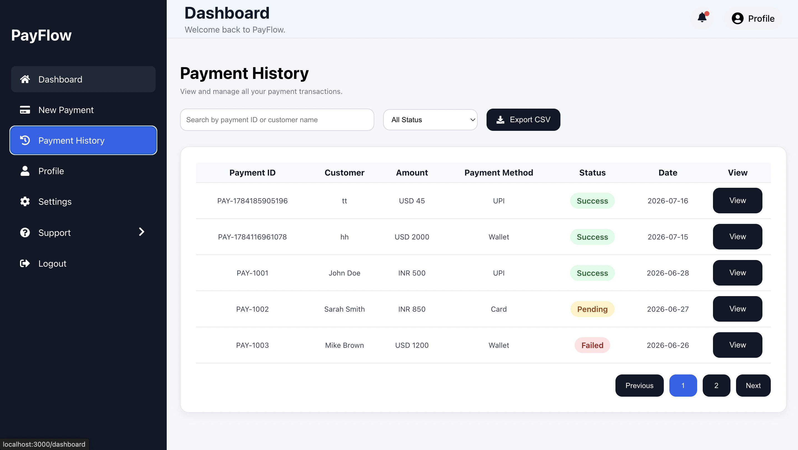

# Payment Details

## Purpose

Displays complete information about a selected payment.

## Information Displayed

- Payment ID
- Customer Details
- Amount
- Currency
- Payment Method
- Status
- Description
- Date

## Buttons

- Close
- Delete

## Result

Provides complete payment information without leaving the Payment History page.

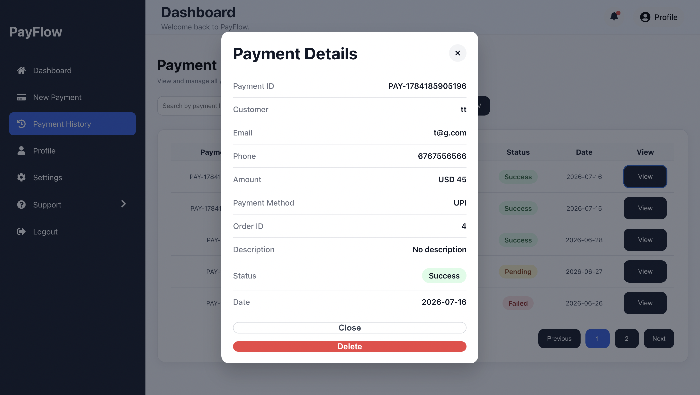

# Profile

## Purpose

Allows users to update their profile information.

| Field | Description | Required | Ediatble Fields 
|--------|-------------| -------- | ------------ |
|  Name | User's name | yes    |  no    |  
| Email | Email address | yes    | no    |  
| Phone number  | User's phone number | yes   |
| Company | Company name | yes   |

## Buttons

- Save Profile
- Cancel

## Result

Profile information is updated successfully.

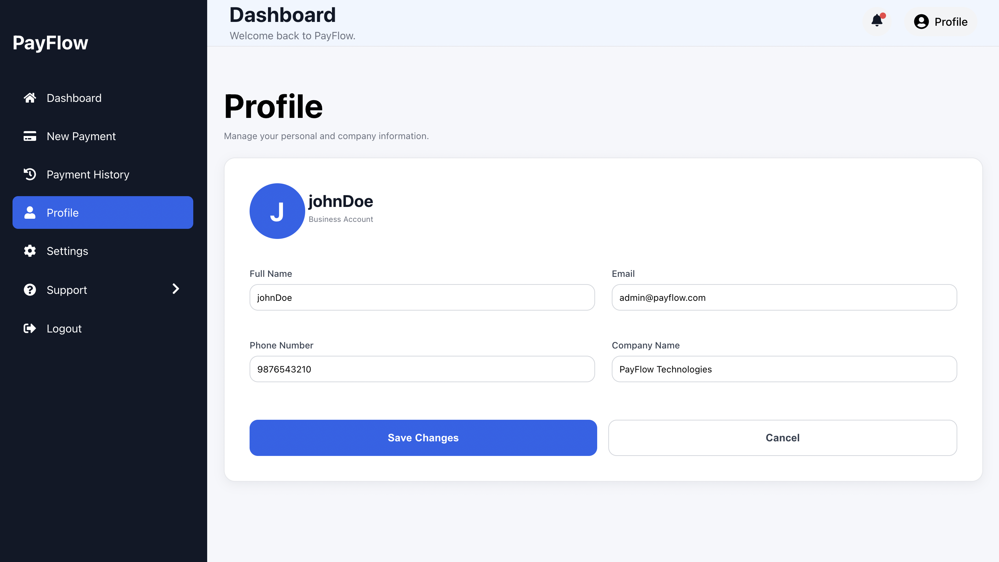

# Change Password

## Purpose

Allows users to update their account password.

## Fields

| Field | Description | Required |
|--------|-------------| -------- |
|  Current Password | User's password | yes    |
|  New Password | New password  | yes    | 
| Confirm Password  | New password should match | yes   |

- Current Password
- New Password
- Confirm Password

## Buttons

- Update Password

## Result

The account password is successfully updated.

# Contact Support

## Purpose

Allows users to submit support requests.

## Fields

| Field | Description | Required | Ediatble Fields |
|--------|-------------| -------- |
|  Name | User's name | yes    | no|
| Email | User's email  | yes    | no|
| Category  | Category of request | yes   | yes   |
| Priority  | Priority of request | yes   | yes   |
| Subject  | Subject of request | yes   | yes   |
| Description  | Description of request | yes   | yes   |
| Screenshot  | Screenshot of request  in image format | no   | yes   |

## Buttons

- Submit Ticket

## Result

A support ticket is created successfully.

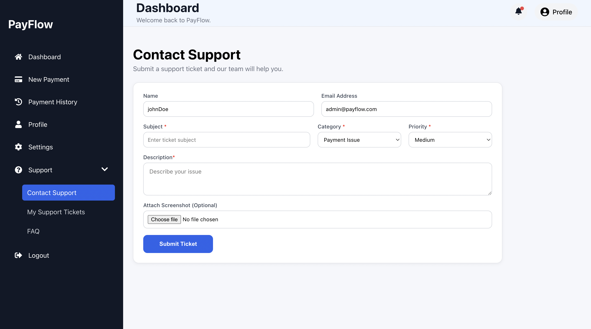

# Support Tickets

## Purpose

Displays all submitted support tickets.

## Features

- Search
- Status Filter
- Pagination
- View Ticket
- Delete Ticket

## Table Columns

- Ticket ID
- Subject
- Priority
- Status
- Created Date

## Result

Users can manage all submitted support requests.

# Support Ticket Details

## Purpose

Displays detailed information about a support ticket.

## Information Displayed

- Ticket ID
- Subject
- Category
- Priority
- Status
- Description
- Assigned To
- Attachment

## Buttons

- Close
- Delete

## Result

Users can review or remove an existing support ticket.

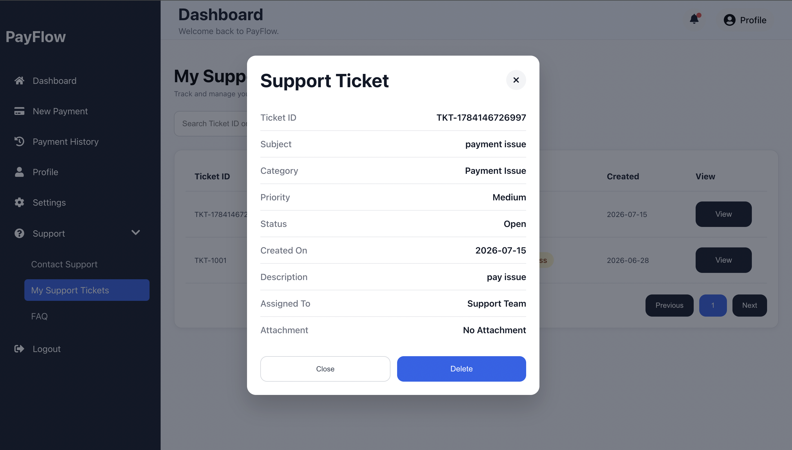

# Frequently Asked Questions

## Purpose

Provides answers to common questions related to the application.

## How to Use

1. Open the FAQ page.
2. Click the **+** icon beside a question.
3. Review the answer.
4. Click again to collapse the section.

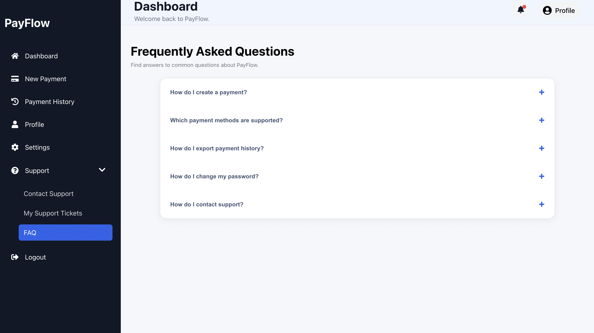
